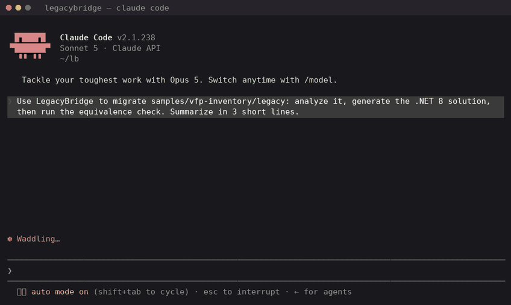

# LegacyBridge

> AI-agent pipeline that analyzes Visual FoxPro / PowerBuilder code, extracts its business logic, and generates an equivalent **.NET 8 / C# solution with Clean Architecture + DDD** — proven correct by **automatically generated functional-equivalence tests**.
>
> Also available as a CLI, a web dashboard, and an **MCP server** for AI coding agents.




---

## The problem

Migrating a legacy system is not expensive because the new code is hard to write.
It is expensive because **nobody can prove the new system behaves like the old one.**

Teams spend 60–80% of a migration budget on reverse-engineering business rules buried in `.prg` and `.sru` files, and on manual regression testing. AI code translators make this worse: they produce code that *looks* right but silently changes business logic.

**LegacyBridge treats equivalence as the product, not the translation.**

## How it works

```
VFP / PowerBuilder source (.prg, .scx, .sru + DBF tables)
        │
        ▼
┌───────────────────┐   deterministic lexer + parser (C#)
│   Parser → IR     │   → unified intermediate representation (JSON)
└─────────┬─────────┘
          ▼
┌───────────────────┐   Agent 1: maps entities, rules, flows, embedded SQL
│  Business Spec    │   → versioned YAML business specification
│  Extractor (LLM)  │
└─────────┬─────────┘
          ▼
┌───────────────────┐   Agent 2: .NET 8 solution — Domain / Application /
│  .NET Generator   │   Infrastructure layers, EF Core, DDD patterns
│  (LLM + templates)│
└─────────┬─────────┘
          ▼
┌───────────────────┐   Agent 3: generates test cases, runs BOTH versions
│ Equivalence Tester│   (legacy vs. .NET) on the same data, diffs outputs
│        ⭐         │   → equivalence report with % functional match
└─────────┬─────────┘
          ▼
┌───────────────────┐   eval suite in CI: extraction recall, compile, equivalence
│  Evals            │   thresholds in evals/thresholds.json — build fails if they drop
└───────────────────┘
```

## Quickstart (2 minutes)

```bash
git clone https://github.com/marius1973/legacybridge.git
cd legacybridge
docker compose up --build
# open http://localhost:3000 — Run bundled sample
```

Without Docker:

```bash
npm install --prefix src/agents
npm install --prefix src/dashboard
dotnet run --project src/LegacyBridge.Cli -- analyze samples/vfp-inventory/legacy --output ir.json
dotnet run --project src/LegacyBridge.Cli -- analyze samples/pb-billing/legacy --output ir-pb.json
dotnet run --project src/LegacyBridge.Cli -- extract samples/vfp-inventory/legacy --output spec.yaml
dotnet run --project src/LegacyBridge.Cli -- generate samples/vfp-inventory/legacy --output samples/vfp-inventory/migrated --build --spec spec.yaml
dotnet run --project src/LegacyBridge.Cli -- verify samples/vfp-inventory/legacy --output samples/vfp-inventory/EQUIVALENCE-REPORT.md
npm run dev --prefix src/dashboard
# http://localhost:3000
```

## Results on the bundled sample

| Metric | Value |
|---|---|
| Extractor entities (`inv_calc`) | P=1.00 R=1.00 *(CI)* |
| Extractor rules (`inv_calc`) | P=1.00 R=1.00 *(CI, threshold R≥0.8)* |
| Functional equivalence (`inv_calc`) | **100%** (148/148, 1 SQL skipped) *(CI, threshold ≥90%)* |
| PowerBuilder NVO (`n_billing.sru`) vs same oracle | **100%** (108/108, 1 SQL skipped) |
| Generated code compiling without manual edits | **100%** on `inv_calc` *(CI, 1 compile attempt)* |
| Compile-fix loop iterations (`inv_calc`) | **0** — method bodies come from the IR AST, not an LLM |
| Migration time (sample) | minutes vs. ~40 h manual estimate |
| Eval cases in CI | extract R≥0.8 · generate compiles · verify ≥90% · MCP `--self-test` |

*Targets are published as CI-enforced thresholds, not marketing: the build fails if a change drops equivalence (or extractor recall) below the threshold.*

## Use it from an AI agent (MCP)


*Real session: Claude Code calls `analyze_legacy`, `generate_dotnet` and `run_equivalence` over stdio. The generated solution builds on the first attempt.*

LegacyBridge exposes the pipeline as an [MCP](https://modelcontextprotocol.io) server (stdio). After `npm install --prefix src/agents`, point the host at the repo root `.mcp.json`:

```json
{
  "mcpServers": {
    "legacybridge": {
      "command": "node",
      "args": [
        "src/agents/node_modules/tsx/dist/cli.mjs",
        "src/agents/mcp-server/index.ts"
      ]
    }
  }
}
```

| Tool | What it does |
|---|---|
| `analyze_legacy` | Parse `.prg` / `.sru` / `.srd` → IR summary (routines, parameters, statement counts) |
| `generate_dotnet` | Emit .NET 8 DDD solution and `dotnet build` |
| `run_equivalence` | IR oracle vs migrated .NET → match rate |

Ask the agent: *migrate `samples/vfp-inventory/legacy` with LegacyBridge*. It should call the three tools in order. Smoke test without a host: `npx tsx mcp-server/index.ts --self-test` from `src/agents`.

## Supported language subset (honest scope)

Current parser coverage (v0.7):

| Construct | VFP | PowerBuilder |
|---|---|---|
| `PROCEDURE` / `FUNCTION`, `LPARAMETERS` / `PARAMETERS` | ✅ | ✅ `function` / `subroutine` + typed args |
| `LOCAL` (including `m.x`) | ✅ | ✅ typed locals (`decimal ld_x`) |
| `IF / ELSEIF / ELSE / ENDIF` | ✅ | ✅ `if … then` / `end if` |
| `FOR ... TO ... STEP / ENDFOR` / `NEXT` | ✅ | ✅ `end for` |
| `SCAN / ENDSCAN`, `DO WHILE / ENDDO` | ✅ | 🔜 SCAN · ✅ `do while` / `loop` |
| Expressions (typed AST) | ✅ | ✅ same AST |
| Embedded SQL (`SELECT/INSERT/UPDATE/DELETE`) | raw capture | raw capture |
| Forms (`.scx`) / DataWindows | 🔜 | retrieve SQL only (`.srd`) |

A small, well-tested subset beats a broad, fragile one. Expressions are a typed AST
(`literal` / `identifier` / `unary` / `binary` / `call`); `RawText` is kept on each node.
`--strict` fails on unknown statements; the default degrades them to raw `expression` nodes.
Parser line coverage is **99%** (coverlet); CI fails the build below 80%.
Step-by-step: [`docs/walkthrough.md`](docs/walkthrough.md).

## Repository layout

```
src/
  LegacyBridge.Parser/    C# lexer + parser → unified IR (JSON)
  LegacyBridge.Cli/       `legacybridge analyze|extract|generate|verify`
  LegacyBridge.Generator/ IR AST → .NET 8 DDD solution
  LegacyBridge.Equivalence/ IR oracle vs migrated .NET
  agents/                 extractor + MCP server (`analyze_legacy`, `generate_dotnet`, `run_equivalence`)
  dashboard/              Next.js UI: pipeline steps + equivalence table
evals/                    CI thresholds (recall, compile, equivalence)
samples/
  vfp-inventory/          legacy → migrated → EQUIVALENCE-REPORT.md
  pb-billing/             PowerBuilder NVO + DataWindow retrieve → same IR
docs/                     architecture, migration guide, demo assets, walkthrough.md
```

## Design decisions

- **Why an IR instead of direct LLM translation?** Deterministic parsing gives the agents a faithful, inspectable model of the code — and gives you a diffable artifact in code review. LLMs propose; the IR disposes.
- **Why does generate take `--spec`?** Agent 1's YAML is what names entities and fields. Without it the generator falls back to IR heuristics. The spec is not a side document.
- **Why golden cases besides 100% equivalence?** Interpreter and emitter share the IR. Hand-computed `evals/golden-cases.json` checks the oracle independently. Those same numbers become generated xUnit tests.
- **Why equivalence tests instead of snapshots?** Snapshot tests freeze behavior you don't understand. Equivalence tests run the legacy binary semantics against the new domain code on the *same* dataset — that is the property a business actually pays for.
- **Why evals in CI?** An LLM pipeline without evals is a demo. Every prompt/model change is gated on extraction precision and functional-equivalence thresholds.

## Roadmap

- [x] **v0.1** — VFP lexer/parser → IR, CLI `analyze`, CI + tests
- [x] **v0.2** — expression AST, coverage/`--strict`, CLI `extract` + eval
- [x] **v0.3** — .NET 8 generator (DDD + EF Core) from IR AST; `samples/vfp-inventory/migrated/` compiles
- [x] **v0.4** — equivalence tester + eval suite in CI
- [x] **v0.5** — MCP server (`analyze_legacy`, `generate_dotnet`, `run_equivalence`)
- [x] **v0.6** — Next.js dashboard (`docker compose up` → localhost:3000)
- [x] **v0.7** — PowerBuilder frontend (`samples/pb-billing`) → same IR
- [x] **v0.8** — `generate --spec`, CFG cases, golden oracle, string ops, generated xUnit
- [ ] **v1.0** — launch write-up

## Contributing

Issues labeled `good-first-issue` are scoped to be tackled without LLM infrastructure. See `ARCHITECTURE.md` before opening a PR.

## License

MIT © Mario Manrique — 15+ years migrating legacy systems in production (finance, mining, telecom).

---

*If this project helped your migration, a ⭐ helps others find it.*
